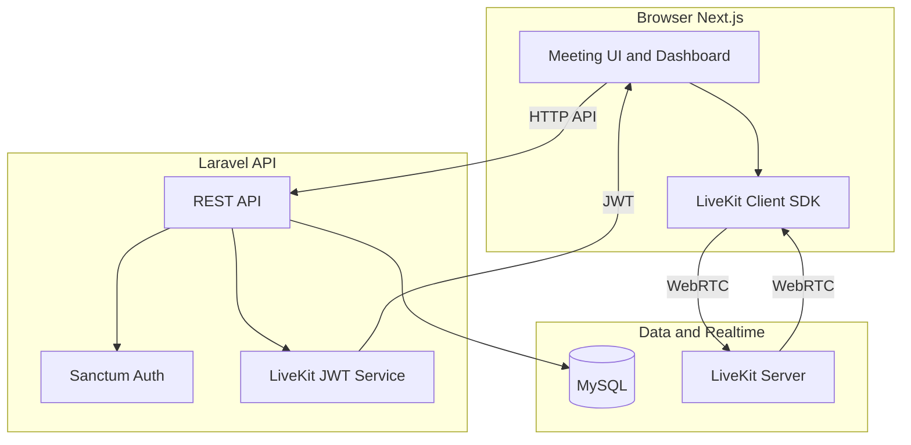
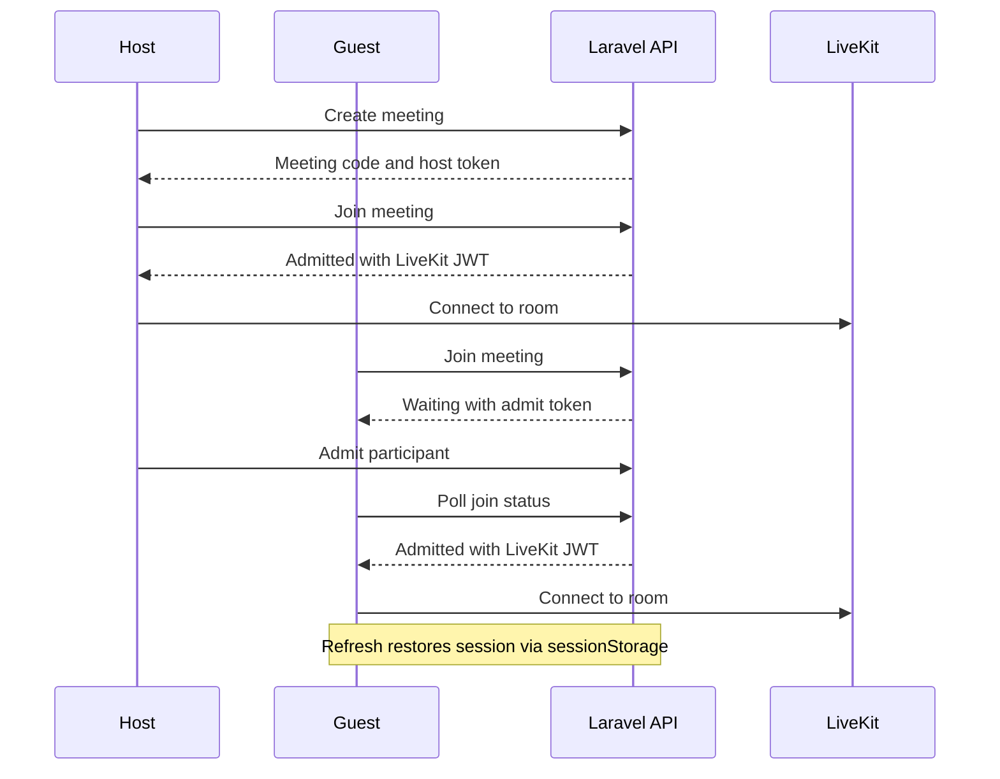

# MeetMe

A self-hosted video meeting platform — a lightweight Google Meet alternative with waiting rooms, guest hosting, collaborative tools, and host-controlled permissions. Built with **Next.js**, **Laravel**, and **LiveKit**.

---

## Features

| Category | Capabilities |
|----------|--------------|
| **Meetings** | Create instant meetings, share links, guest or registered host |
| **Waiting room** | Host admits or denies participants before they enter |
| **Video & audio** | HD calls via LiveKit WebRTC |
| **Screen sharing** | Host-approved screen share with live highlighter overlay |
| **Collaboration** | Shared whiteboard with admin-assigned editor |
| **Engagement** | Hand raise, participant sidebar, copy meeting link |
| **Permissions** | Host controls recording and screen-share access |
| **Accounts** | Register / login, dashboard, admin panel |
| **Guests** | Join or host without an account |

---

## Tech stack

| Layer | Technology | Role |
|-------|------------|------|
| **Frontend** | [Next.js 16](https://nextjs.org/) (App Router), React 19, TypeScript | UI, meeting room, real-time sync over LiveKit data channels |
| **Styling** | Tailwind CSS 4 | Design system and responsive layout |
| **Video SDK** | [LiveKit](https://livekit.io/) (`livekit-client`, `@livekit/components-react`) | WebRTC rooms, tracks, screen share, data messages |
| **Backend** | [Laravel 13](https://laravel.com/) (PHP 8.3) | REST API, auth, meeting logic, token minting |
| **Auth** | Laravel Sanctum + Laravel Breeze | Cookie-based SPA authentication |
| **Database** | MySQL 8 | Users, meetings, participants, permissions |
| **Infrastructure** | Docker Compose | MySQL, LiveKit server, phpMyAdmin (local dev) |

---

## Architecture



### What the frontend handles

- Landing page, auth screens, user dashboard, admin panel
- Meeting join flow (waiting room UI, session restore after refresh)
- LiveKit room UI: camera, mic, layout, participants
- **Real-time features** synced via LiveKit **data channels** (not Laravel polling):
  - Hand raise
  - Whiteboard strokes and editor assignment
  - Screen-share state
  - Screen-share highlighter (normalized coordinates)
  - Recording permission sync
- Session tokens stored in `sessionStorage` (guest host token, admit token)

### What the backend handles

- User registration, login, password reset, admin roles
- Meeting CRUD, unique meeting codes, guest-host tokens
- Waiting room: join requests, admit / deny, participant status
- LiveKit access token generation (JWT signed with API secret)
- Permission workflows: recording and screen-share request / approve / deny
- Admin API: platform stats, user management, meeting cleanup
- CORS and Sanctum stateful API for the Next.js frontend

### Division of responsibility

| Concern | Frontend | Backend | LiveKit |
|---------|----------|---------|---------|
| Authentication | Login forms, cookies | Sanctum sessions | — |
| Join / waiting room | UI + polling | DB status, admit API | — |
| Video / audio | Renders tracks | Mints room token | WebRTC media |
| Whiteboard / highlighter | Canvas + sync | — | Data messages |
| Recording permission | UI state | Persists approval | — |

---

## Meeting workflow



1. **Host** creates a meeting (registered user or guest with name).
2. **Participants** open `/m/{code}` and request to join.
3. If the waiting room is enabled, the **host admits** them from the People sidebar.
4. **Backend** issues a LiveKit JWT; the **frontend** connects to the WebRTC room.
5. In-call features (whiteboard, highlighter, hand raise) sync over LiveKit data topics.
6. **Host** can end the meeting for everyone or participants can leave.

---

## Project structure

```
meetme/
├── frontend/          # Next.js app (port 3000)
│   ├── app/           # Routes: /, /login, /dashboard, /m/[code], /admin
│   ├── components/    # UI + meeting-room feature modules
│   └── lib/           # API client, LiveKit helpers, sync message types
├── backend/           # Laravel API (port 8000)
│   ├── app/
│   │   ├── Http/Controllers/Api/
│   │   ├── Models/
│   │   └── Services/  # LiveKitTokenService, MeetingCodeGenerator
│   ├── database/migrations/
│   └── routes/api.php
├── scripts/           # dev.sh, start-backend.sh
├── docker-compose.yml # MySQL, LiveKit, phpMyAdmin
└── livekit.yaml       # LiveKit server config (reference)
```

---

## Prerequisites

- **Node.js** 20+ and **pnpm**
- **PHP** 8.3+, **Composer**
- **Docker** & Docker Compose (MySQL + LiveKit)
- **Git**

---

## Local development

### 1. Clone and configure

```bash
git clone https://github.com/your-username/meetme.git
cd meetme
```

**Backend** — copy env and generate key:

```bash
cp backend/.env.example backend/.env
cd backend
composer install
php artisan key:generate
```

Set in `backend/.env`:

```env
APP_URL=http://localhost:8000
FRONTEND_URL=http://localhost:3000
DB_CONNECTION=mysql
DB_HOST=127.0.0.1
DB_PORT=3307
DB_DATABASE=meet_db
DB_USERNAME=root
DB_PASSWORD=root
LIVEKIT_URL=ws://localhost:7880
LIVEKIT_API_KEY=devkey
LIVEKIT_API_SECRET=secret
SESSION_DRIVER=file
```

**Frontend**:

```bash
cp frontend/.env.local.example frontend/.env.local
```

```env
NEXT_PUBLIC_API_URL=http://localhost:8000
```

### 2. Start infrastructure

```bash
docker compose up -d
```

| Service | URL / Port |
|---------|------------|
| MySQL | `127.0.0.1:3307` |
| LiveKit | `ws://localhost:7880` |
| phpMyAdmin | http://localhost:8080 |

### 3. Migrate and run backend

```bash
cd backend
php artisan migrate
php artisan serve --host=localhost --port=8000
```

Or from the repo root:

```bash
./scripts/start-backend.sh
```

### 4. Run frontend

```bash
cd frontend
pnpm install
pnpm dev
```

Open **http://localhost:3000** (use `localhost`, not `127.0.0.1`, for cookie/CSRF consistency).

### Quick start script

```bash
./scripts/dev.sh   # starts Docker and prints service URLs
```

---

## Environment variables

| Variable | Where | Description |
|----------|-------|-------------|
| `NEXT_PUBLIC_API_URL` | Frontend | Laravel API base URL |
| `APP_URL` | Backend | Public API URL |
| `FRONTEND_URL` | Backend | Allowed CORS / Sanctum origin |
| `DB_*` | Backend | MySQL connection |
| `LIVEKIT_URL` | Backend | LiveKit WebSocket URL (`ws://` or `wss://`) |
| `LIVEKIT_API_KEY` | Backend | LiveKit API key |
| `LIVEKIT_API_SECRET` | Backend | Secret for signing JWTs |
| `APP_KEY` | Backend | Laravel encryption key |

---

## API overview

| Method | Endpoint | Description |
|--------|----------|-------------|
| `POST` | `/api/register`, `/api/login` | Authentication |
| `POST` | `/api/meetings` | Create meeting (auth) |
| `POST` | `/api/meetings/guest` | Create guest-hosted meeting |
| `GET` | `/api/meetings/{code}` | Meeting metadata |
| `POST` | `/api/meetings/{code}/join` | Join or resume session |
| `GET` | `/api/meetings/{code}/join-status` | Poll waiting / restore admitted |
| `POST` | `/api/meetings/{code}/participants/{id}/admit` | Host admit |
| `POST` | `/api/meetings/{code}/end` | End meeting for all |
| `GET` | `/api/admin/*` | Admin dashboard (auth + admin) |

Full routes: [`backend/routes/api.php`](backend/routes/api.php)

---

## Deployment notes

MeetMe is a **multi-service** app. A typical production setup:

| Component | Suggested hosting |
|-----------|-------------------|
| Frontend (`frontend/`) | [Vercel](https://vercel.com), Netlify, or any Node host |
| Backend (`backend/`) | Railway, Render, Fly.io, or a VPS |
| MySQL | Managed MySQL (PlanetScale, Railway, DigitalOcean) |
| LiveKit | [LiveKit Cloud](https://livekit.io/cloud) or self-hosted VPS |

Use HTTPS everywhere and set `LIVEKIT_URL` to `wss://` in production.

---

## Troubleshooting

| Issue | Fix |
|-------|-----|
| Login / join stuck loading | Ensure backend on port **8000**, MySQL running, use `localhost` not `127.0.0.1` |
| Port 8000 in use | Run `./scripts/start-backend.sh` or `fuser -k 8000/tcp` |
| No video / room fails | Confirm LiveKit is up: `docker compose ps` |
| CSRF / cookie errors | Match `FRONTEND_URL` and browser URL (both `localhost`) |

---

## License

MIT — add a `LICENSE` file before publishing if you want to open-source the repo.

---

## Author

Built as a personal, self-hosted meeting solution. Contributions and issues welcome.
